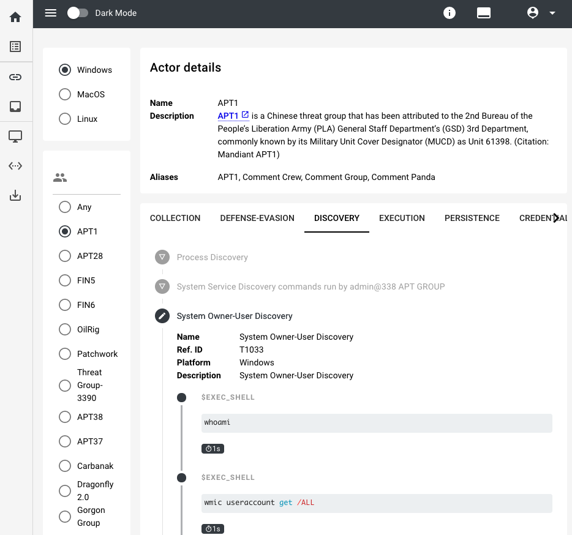
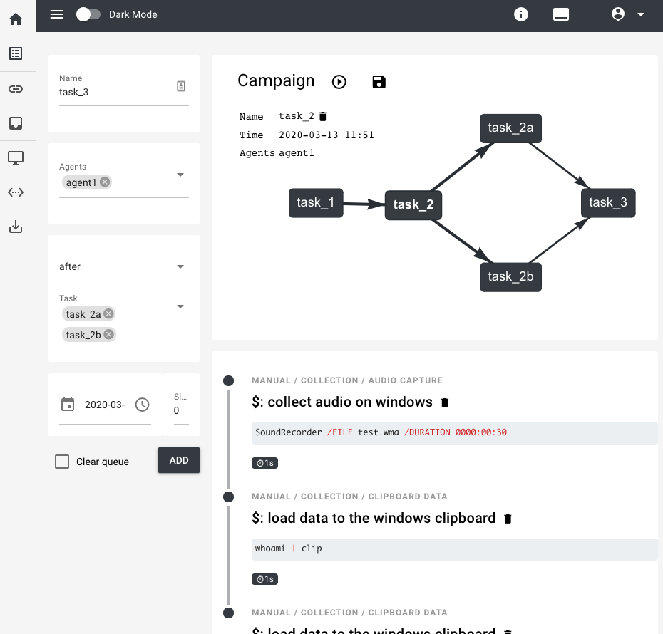
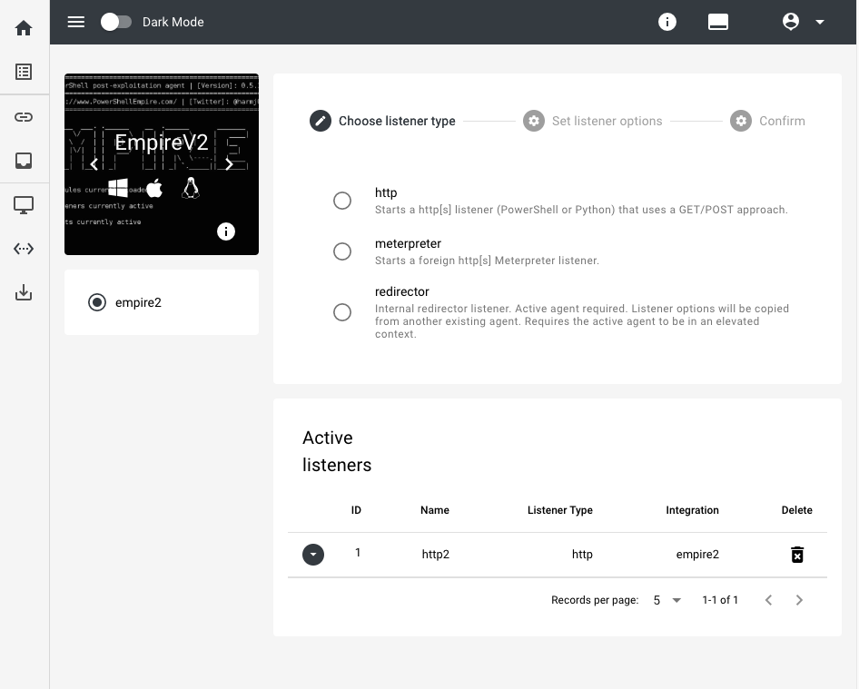
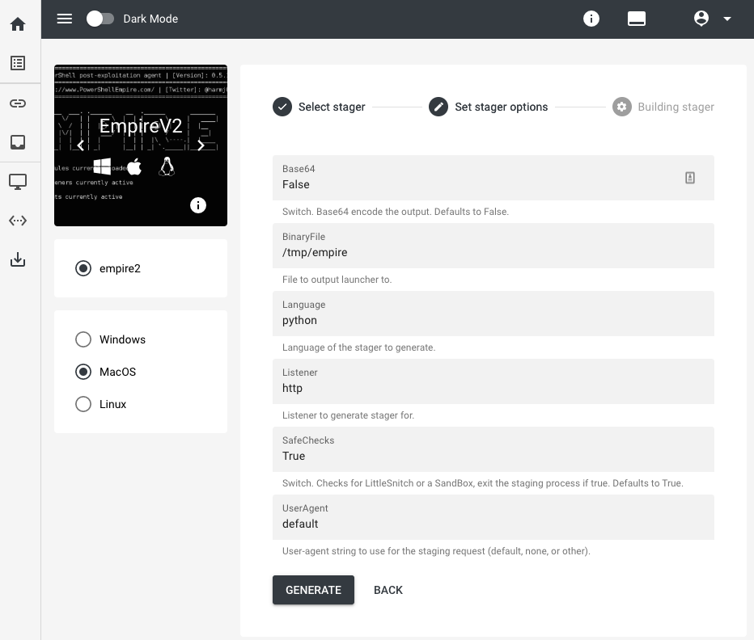
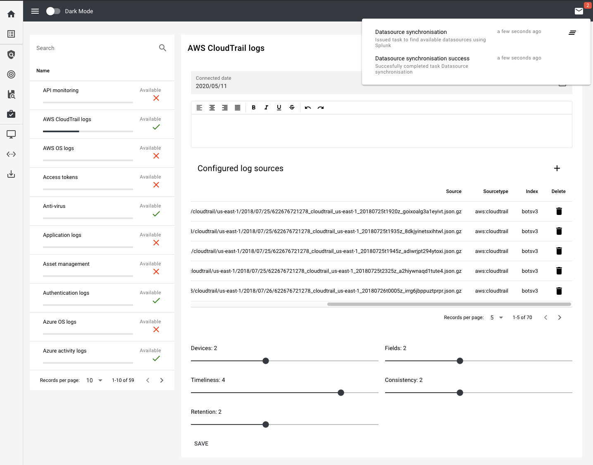
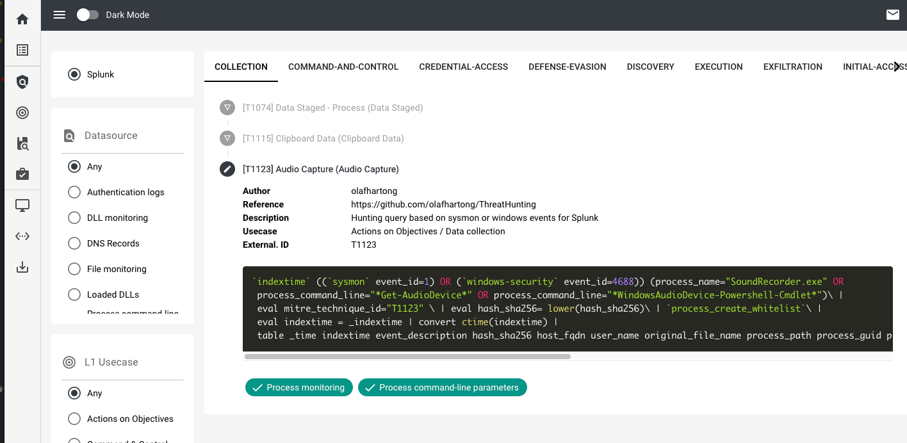
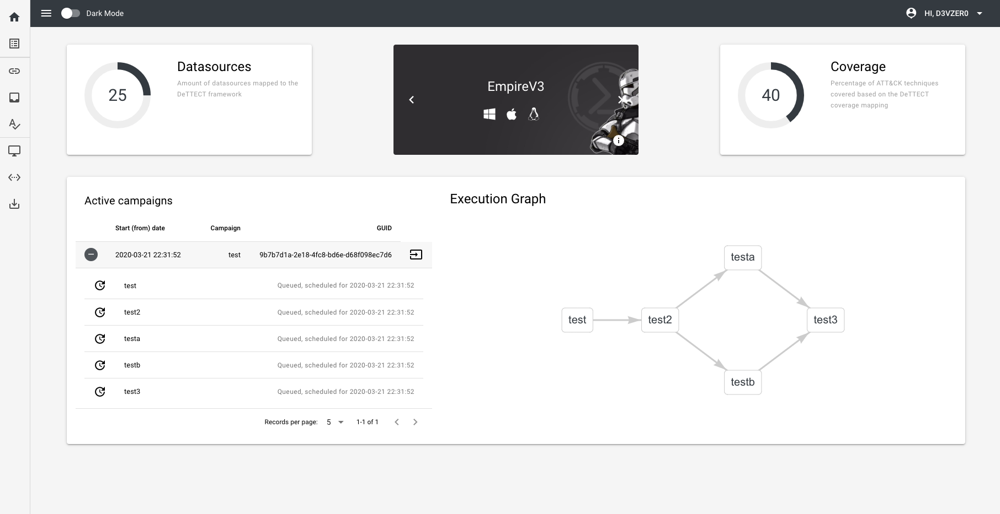

#  RE:TERNAL
-------------

---------------------

#### Note: Still under development, only use for testing and do not expose interfaces! Current compose doesn't work yet, only try when you know what you're doing #####

RE:TERNAL is a centralised purple team orchestration service to manage third-party C2 frameworks. Agents are installed on endpoints to  to execute various known
red-teaming techniques in order to test blue-teaming capabilities. The simulations are mapped to the MITRE ATT&CK framework. This repo contains
the compose file in order to set up the reternal platform via docker. 

There is a public preview available running the latest version @ https://reternal.d3vzer0.com (Github login required). Executing/saving campaigns and interacting with the C2 modules is disabled (for obvious reasons ;)).

## Reternal components
| Component        | Description | Code           | Build  |
| ------------- |:-------------- |:--------------| :------| 
| [API](https://github.com/d3vzer0/reternal-backend)      | Administrative API to schedule tasks |  |  |
| [UI](https://github.com/d3vzer0/reternal-ui)     | VueJS-based UI buildscript and NGinx webserver | |  |
| [C2](https://github.com/d3vzer0/reternal-c2) | Distributed tasks to interact with external C2 frameworks |  |  |
| [Search](https://github.com/d3vzer0/reternal-search)     | Distributed tasks to execute search queries (ie. Splunk/Elasticsearch) for ATT&CK coverage rating |  |  |
| [Mitre](https://github.com/d3vzer0/reternal-mitre)     | Repository containing already existing mapped techniques for reternal |

| Component        | Description | Build  |
| ------------- |:-------------- | :------| 
| Total Stack | Build verifying entire stack via docker-compose in this repository | TODO |

## Install and Configuration
This repository contains Ansible deployment playbooks to automate the local or remote installation and configuration for Reternal. The guide can be found on the repo's Wiki @ https://github.com/d3vzer0/reternal-quickstart/wiki.  

## Developers and Contact

Joey Dreijer < joeydreijer@gmail.com >  
Yaleesa Borgman < yaleesa@gmail.com >

## Whats up with the name?

This project has been re-developed so many times, it will probably never really finish. Hence RE (Redo) and Ternal (Eternal).

#### Special Thanks
  - Rabobank DeTTECT - Framework for mapping your log coverage against MITRE ATT&CK. Used the fundementals for the internal coverage rating and scenario suggestions: https://github.com/rabobank-cdc/DeTTECT
  - MITRE ATT&CK - Framework used for mapping simulations: https://attack.mitre.org/wiki/Main_Page
  - Uber Metta -  Using Metta's templates for MITRE techniques with small (optional) adjustments to the purple_action format: https://github.com/uber-common/metta
  - https://github.com/olafhartong/sysmon-modular - Splunk app with out-of-the-box queries to hunt for malicious events based on Sysmon
  - https://www.splunksecurityessentials.com/ - Must have Splunk app to extend your current detection capabilities. The app analyses the available sourcetypes and provices suitable tips/tricks to improve the overal use of Splunk for Hunting and Detection.

## Examples and screenshots
All of the features will be documented on the Welcome page of the Wiki @ https://github.com/d3vzer0/reternal-quickstart/wiki. Below are a few examples of the main components.

### Actor / Technique mapping
Reternal automatically maps available commands and techniques to actors. You can directly add all the techniques commonly used by actors to your set of tasks.

### Recipe / Graph builder
Scheduling tasks to be run on an agent is called a graph. You can add manual commands to a graph or select one of the existing mapped techniques or actor TTPs. You can drag/drop to change the order of the tasks in your graph.

### C2 interaction
Reternal acts as a piece of middleware and interacts with external C2 frameworks. An example is shown below how Reternal manages external listeners and generates stagers.

### Coverage rating (based on Rabo DeTTECT)
Automatically synchronise the available datasources with your Splunk environment or add logsources manually. Reternal will suggest specific campaigns to execute based on your coverage rating.

With an overview of your coverage compared to all the ATT&CK techniques:

### Integrated Hunts
Additionally a list of Splunk queries are included to automatically validate simulations. Soon (tm) the scheduled campaign will automatically run relevant queries and present a detailed report containing the findings (ie. time when attack was performed vs. time of detection etc)

### Campaign state and dashboard
The main dashboard displays the state of your running campaigns and displays the expected coverage of your datasources vs techniques

